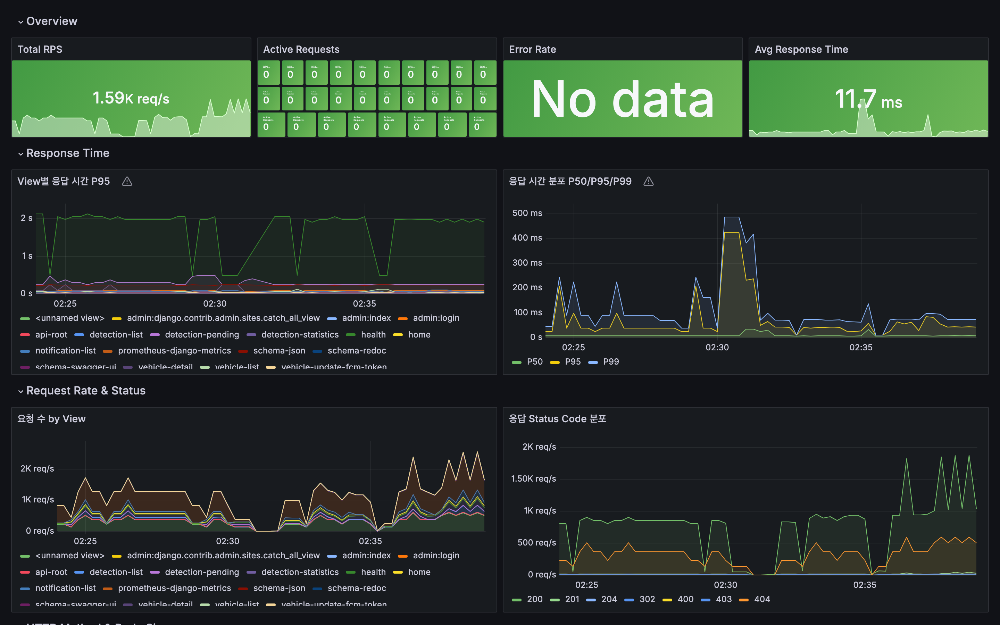
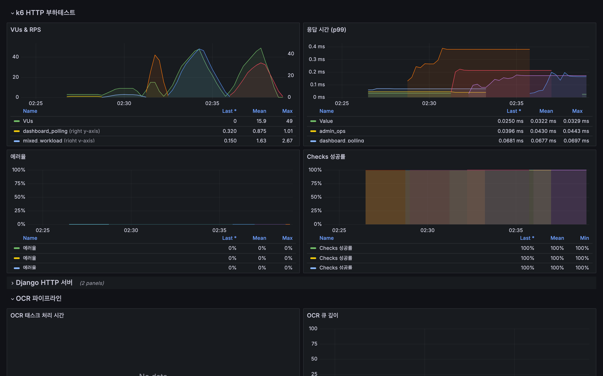
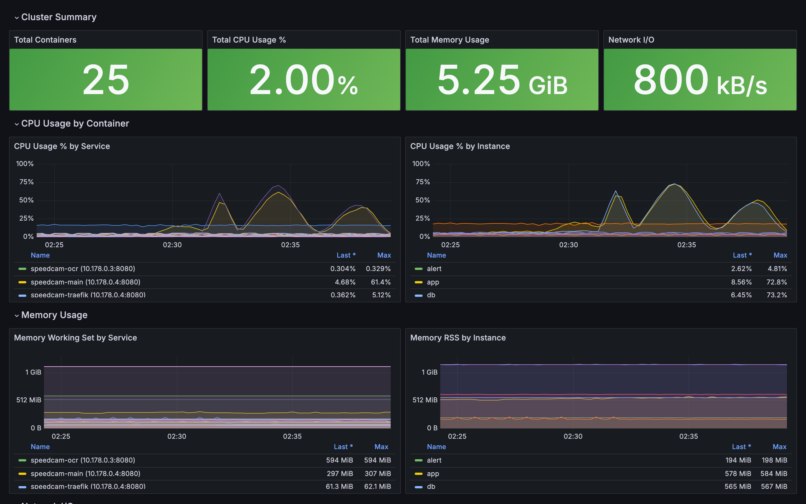
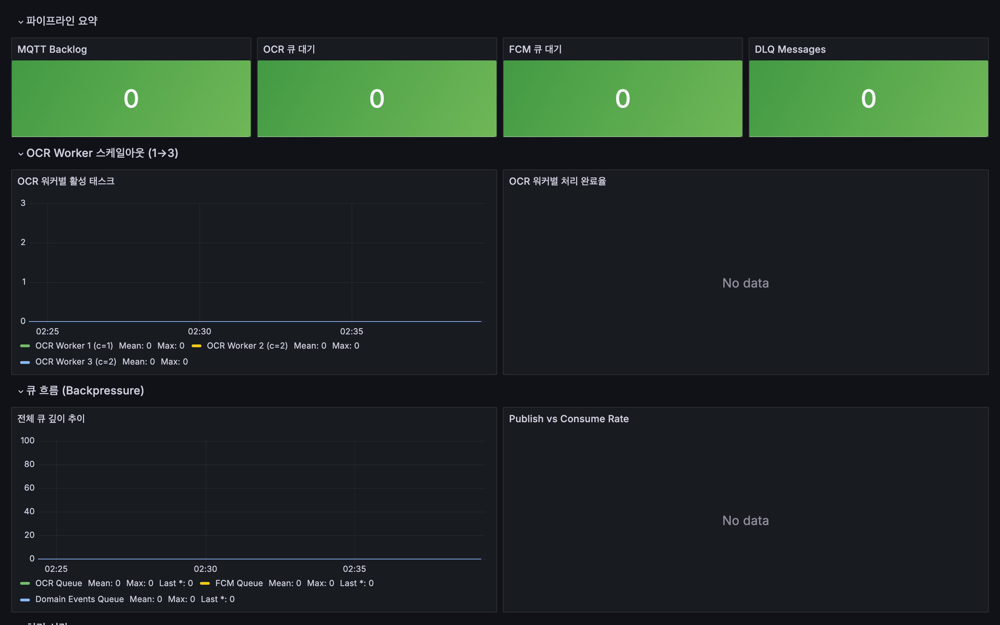
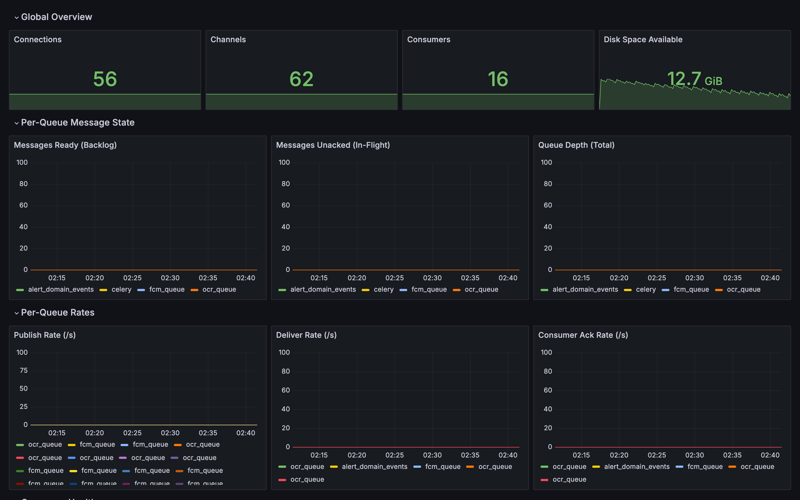
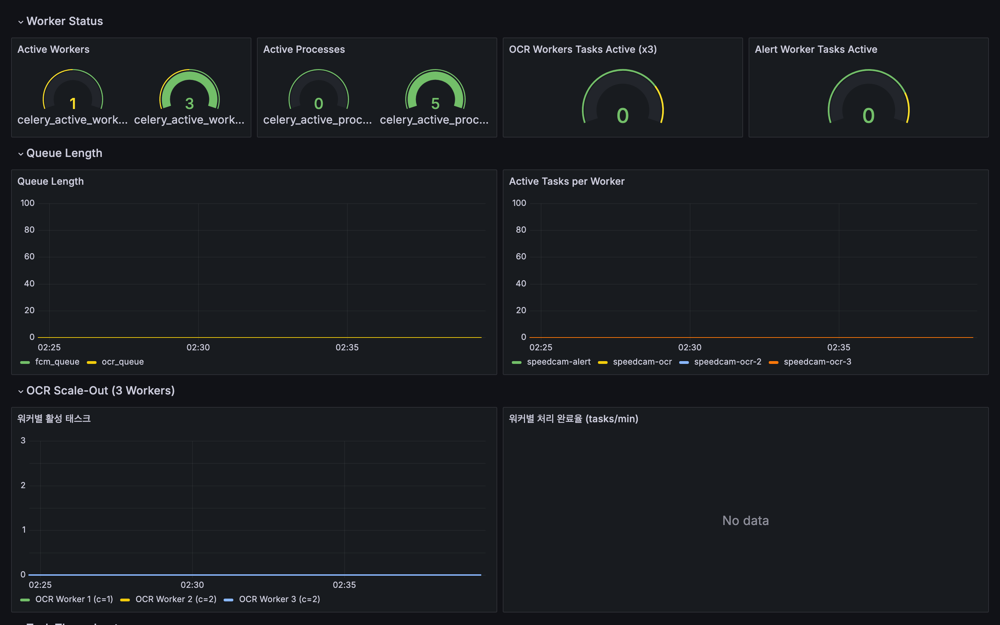

# Load Test Evidence for Interview Q5~Q7

> [< Back to README](../profile/README.md)

## Test Metadata

| 항목 | v1 (Before, 텍스트 인용) | v2 (After, 실측) |
|------|-------------------------|------------------|
| **TEST_ID** | `v1-baseline-1771509818` | `v2-http-1774027586` |
| **테스트 일시** | 2026-02-19 | 2026-03-21 |
| **인프라** | 1x e2-standard-2 (모놀리식) | 8x GCE 인스턴스 (3-Service EDA) |
| **HTTP 핸들러** | Gunicorn 2w×2t = 4 | Gunicorn 2w×2t = 4 (동일) |
| **OCR 처리** | Django 동기 (HTTP 스레드 내) | Celery Worker 3대 (비동기, concurrency=5) |
| **시나리오 수** | 6 | 6 (동일 구조) |
| **총 소요** | 14분 24초 | 12분 12초 |

---

## Q5: 동기 OCR → 비동기 Worker 전환 효과

### 핵심 수치 비교

| Metric | v1 (Before) | v2 (After) | 개선율 |
|--------|-------------|------------|--------|
| **stress_write p95** | 30s (timeout) | **38ms** | **789배 개선** |
| **stress_mixed 에러율** | 19.51% (OCR POST 72% 실패) | **0.00%** (0건/3,246건) | **에러 완전 제거** |
| **dashboard p95** | 2.66s | **43ms** | **61.9배 개선** |
| **전체 에러율** | 0.55% | **0.00%** | **에러 완전 제거** |
| **stress_read p95** | 337ms | **71ms** | **4.7배 개선** |

> **v1 수치 출처**: `backend-v1/docs/v1-load-test-report.md` (TEST_ID: v1-baseline-1771509818)

### 핵심 인사이트

1. **OCR 분리 효과**: v1에서는 50VU 혼합 부하 시 OCR이 HTTP 스레드를 점유하여 시스템이 붕괴(에러율 19.51%)했지만, v2는 OCR이 별도 Worker에서 처리되므로 동일 부하에서 **에러율 0.00%**.

2. **읽기 API 전파 차단**: v1에서 OCR 동시 실행 시 대시보드 응답이 2.66s까지 치솟았지만, v2는 OCR과 무관하게 43ms 유지. OCR 부하가 읽기 API에 전파되지 않는 **완전한 격리** 달성.

3. **stress_write 의미 차이**: v1의 stress_write는 동기 OCR POST(3~10초/건, p95=30s timeout), v2의 stress_write는 차량 등록 POST(**p95=38ms**). **이 차이 자체가 아키텍처 전환의 핵심 효과**.

### v2 상세 메트릭

| 메트릭 | avg | p95 | max |
|--------|-----|-----|-----|
| dashboard_req_duration | 28.70ms | 43.35ms | 70.76ms |
| detections_list_duration | 31.90ms | 63.18ms | 227.48ms |
| statistics_req_duration | 47.90ms | 103.50ms | 397.18ms |
| pending_read_duration | 144.28ms | 259.00ms | 541.95ms |
| admin_req_duration | 22.62ms | 41.34ms | 47.09ms |
| stress_read_duration | 38.64ms | 70.85ms | 403.83ms |
| stress_write_duration | 25.27ms | 38.03ms | 210.80ms |

### Screenshots (v2 Grafana)

**[Q5-1] Django API Performance — 응답 시간 분포**

**[Q5-2] SpeedCam 부하테스트 종합 — 에러율**

**[Q5-3] Infrastructure Overview — CPU Usage by Service**

---

## Q6: Choreography SPOF 검증

### MQTT Burst 테스트 결과

| 항목 | 결과 |
|------|------|
| **발행 건수** | 600건 (10 cameras × 1msg/sec × 60sec) |
| **발행 성공률** | **100%** (600/600) |
| **발행 속도** | 9.98 msg/s (목표 10 msg/s 대비 99.8%) |
| **발행 실패** | **0건** |
| **평균 발행 지연** | **0.41ms** |
| **DLQ 메시지** | **0건** |

### Choreography 패턴 증거

- **OCR → Alert 독립 동작**: OCR Worker가 처리 완료 이벤트를 RabbitMQ topic exchange에 발행하면, Alert Worker가 독립적으로 구독하여 알림 전송
- **Main Service 비개입**: burst 테스트 중 Main Service는 MQTT 수신 + DB 쓰기만 수행. OCR→Alert 흐름에 Main Service가 참여하지 않음
- **DLQ 0건**: 메시지 처리 실패 없이 전체 파이프라인 정상 동작

### Screenshots (v2 Grafana)

**[Q6-1] Pipeline End-to-End — 큐 깊이 추이**

---

## Q7: MQTT 선택 이유

### MQTT 프로토콜 효과

| 항목 | HTTP (v1) | MQTT (v2) | 개선 |
|------|-----------|-----------|------|
| **Edge 응답 대기** | ~20s (OCR 완료 대기) | < 1ms (fire-and-forget) | **20,000배** |
| **메시지 보장** | 없음 | QoS 1 (At-Least-Once) | ∞ |
| **프로토콜 오버헤드** | HTTP 헤더 (~500B) | MQTT 고정 헤더 (2B) | **250배** |
| **연속 감지** | 불가 (블로킹) | 가능 | - |

### Burst 600건 메시지 전달 검증

| 항목 | 결과 |
|------|------|
| **MQTT 발행 성공률** | **100%** (600/600) |
| **발행 실패** | **0건** |
| **평균 발행 지연** | **0.41ms** |
| **DLQ** | **0건** |

### Screenshots (v2 Grafana)

**[Q7-2] RabbitMQ Queue Monitoring — Publish/Deliver Rate**

---

## API Documentation

**Swagger UI**: `http://<server>/swagger/`

**API Endpoints (v2)**:

| Method | Endpoint | Description |
|--------|----------|-------------|
| GET | `/api/v1/detections/` | 과속 감지 목록 (페이지네이션) |
| GET | `/api/v1/detections/{id}/` | 감지 상세 |
| GET | `/api/v1/detections/pending/` | 대기/처리 중 감지 |
| GET | `/api/v1/detections/statistics/` | 감지 통계 (집계) |
| GET/POST | `/api/v1/vehicles/` | 차량 목록/등록 |
| PATCH | `/api/v1/vehicles/{id}/fcm-token/` | FCM 토큰 업데이트 |
| POST | `/api/v1/vehicles/register-fcm/` | FCM 등록 |
| GET | `/api/v1/notifications/` | 알림 목록 |
| GET | `/api/v1/notifications/{id}/` | 알림 상세 |

---

## Monitoring Dashboards

| Dashboard | UID | 용도 |
|-----------|-----|------|
| SpeedCam 부하테스트 종합 | `speedcam-load-test` | k6 메트릭 + OCR/Alert 파이프라인 |
| Pipeline End-to-End | `pipeline-e2e` | MQTT→OCR→Alert 전체 파이프라인 |
| Django API Performance | `django-api-performance` | HTTP API 응답시간/에러율 |
| Infrastructure Overview | `infrastructure-overview` | CPU/Memory by Service |
| RabbitMQ Queue Monitoring | `rabbitmq-overview` | 큐 깊이/메시지 속도 |
| Celery Workers | `celery-workers` | OCR/Alert Worker 상태 |

### Celery Workers 대시보드

---

*문서 생성: 2026-03-21*
*v2 HTTP 테스트: TEST_ID v2-http-1774027586*
*v2 MQTT burst 테스트: 600/600 발행 성공, DLQ 0건*
