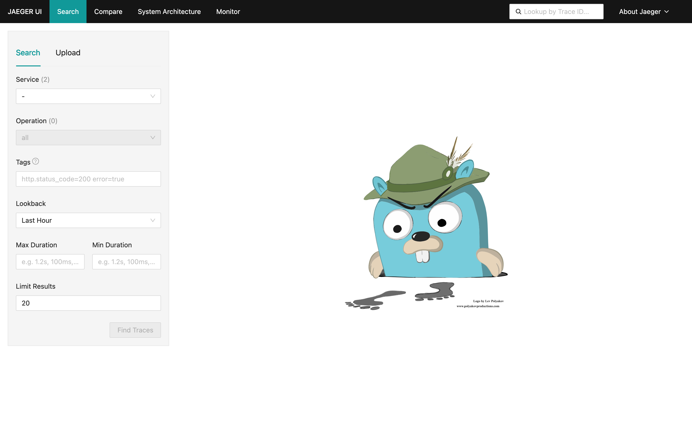
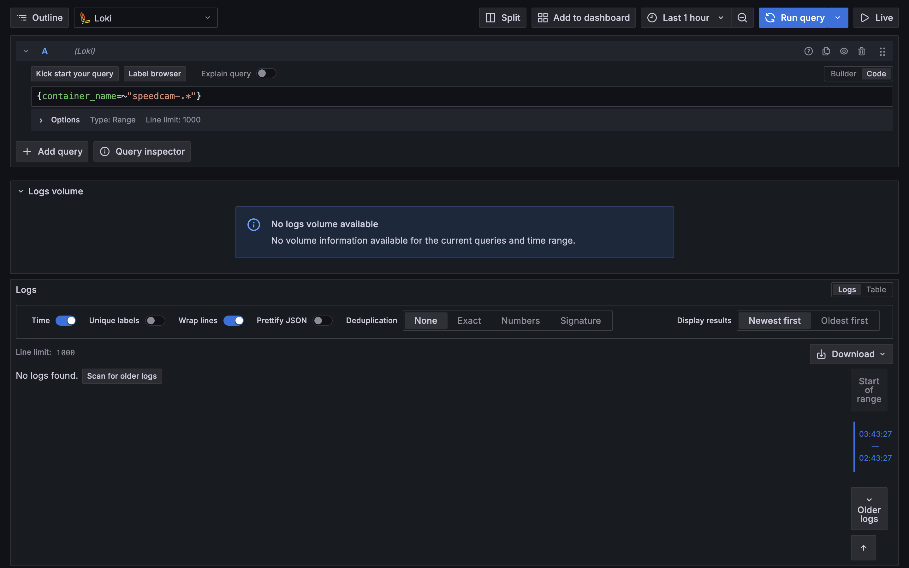

# SpeedCam — 실시간 과속탐지 및 알림 시스템 with Qualcomm

<h4>https://auto-notify.vercel.app/</h4>
<h2>SpeedCam — 실시간 과속탐지 및 알림 시스템</h2>
<h3>3-Service Event-Driven Architecture 기반 스마트 교통 시스템. 
Rubik Pi 엣지 디바이스에서 MQTT로 과속 감지 데이터를 전송하면, 
OCR 번호판 인식 → FCM 푸시 알림까지 자동 처리. 
Database per Service 패턴(4개 독립 DB) 적용.</h3>

 

## 📑 Contents
- [Demo](#demo)
- [System Architecture](#system-architecture)
- [Tech Stack](#tech-stack)
- [Notification System Design](#notification-system-design)
- [Rubik Pi 3](#rubik-pi-3)
- [API](#api)
- [Monitoring](#monitoring)
- [CI/CD](#ci-cd)
- [Member](#member)

<h2>🖥️ Demo</h2>
<h3>시연 영상</h3>
https://www.youtube.com/watch?v=FDzbjOeika8

<h3>메인페이지(과속 차량 목록보기)</h3>

<h3>과속 차량 개별 보기</h3>

<h3>알림 확인하기</h3>

 
 

<h2>🏛️ System Architechture</h2>

[자세히 보기](https://www.notion.so/2f33187fa1c980e1895cfef39b2c8ec7?pvs=21)

<blockquote>
3개 서비스(Main/OCR Worker/Alert Worker)로 구성된 Event-Driven Architecture. Rubik Pi가 MQTT로 과속 감지 데이터를 전송하면, Main Service가 수신 → OCR Worker가 번호판 인식 → Alert Worker가 FCM 푸시 알림을 전송한다. Database per Service 패턴(4개 독립 DB), Choreography 패턴, Dead Letter Queue를 적용.
  
<a href="../docs/ARCHITECTURE-EVOLUTION.md">Architecture Evolution 상세 보기 →</a>
</blockquote>

<h2>🛠️ Tech Stack</h2>

<h4>Frontend</h4>

 
 
<h4>Backend</h4>

 
 
<h4>Infra</h4>

 
 
<h4>Monitoring</h4>

 
 
<h4>etc</h4>

 
 

 

<h2>Notification System Design</h2>

Choreography 패턴 기반 알림 시스템. OCR 완료 시 domain_events exchange에 이벤트를 발행하면, Kombu Consumer가 수신하여 Celery gevent Worker가 FCM 푸시를 전송한다. Dead Letter Queue와 Ack/Nack 메커니즘으로 메시지 유실을 방지.

> [Notification System Design 상세 보기 →](../docs/NOTIFICATION-SYSTEM-DESIGN.md)

<h2>Rubik Pi 3</h2>

Qualcomm 기반 Rubik Pi에서 YOLO 객체 탐지와 GStreamer를 활용한 실시간 과속 차량 감지 엣지 시스템. 카메라 입력부터 추론, 트래킹, 속도 측정까지 모든 과정을 로컬에서 처리.

> [Rubik Pi Edge System 상세 보기 →](../docs/RUBIK-PI-EDGE-SYSTEM.md)

 

<h2>📁 API</h2>

Django REST Framework 기반 API. Vehicle CRUD, Detection 조회/통계, Notification 이력 등 15+ 엔드포인트 제공. Swagger/ReDoc 자동 문서화.

<h3>Swagger</h3>

<h3>Postman</h3>

 

<h2>🔍 Monitoring</h2>

OpenTelemetry + Jaeger 분산 트레이싱, Prometheus + Grafana 메트릭 대시보드, Loki + Promtail 로그 수집, Flower Celery 모니터링, RabbitMQ Management 큐 대시보드로 구성된 풀스택 관측성.

<h3>Grafana Dashboard</h3>

<h3>Jaeger Tracing</h3>

<!-- TODO: 수동 캡처 필요 — http://localhost:16686 에서 트레이스 검색 후 캡처 -->

<h3>RabbitMQ Management</h3>

<h3>Loki + Promtail Logs</h3>

<!-- TODO: 수동 캡처 필요 — Promtail 로그 수집 후 Grafana Explore에서 캡처 -->

 

<h2>⚙️ CI/CD</h2>

GitHub Actions 기반 CI 파이프라인. Lint(flake8/black/isort), Test(pytest + MySQL), Docker Build(3개 이미지) 자동 검증. main 브랜치 push 시 GCP Artifact Registry에 이미지 배포.

<h2>Member</h2>

<table width="1000">
    <thead>
    </thead>
    <tbody>
    <tr>
        <th>Pictures</th>
         <td width="100" align="center">
            
        </td>
        <td width="100" align="center">
            
        </td>
        <td width="100" align="center">
            
        </td>
        <td width="100" align="center">
            
        </td>
    </tr>
    <tr>
        <th>Name</th>
        <td width="100" align="center">이상훈</td>
        <td width="100" align="center">진민우</td>
        <td width="100" align="center">최명헌</td>
        <td width="100" align="center">서정찬</td>
    </tr>
    <tr>
        <th>Position</th>
        <td width="10" align="center">
            Leader 
            Backend 
            DevOps 
            Design 
        </td>
        <td width="100" align="center">
            Rubik Pi 
            Tracking 
            Calculate 
            YOLO 
        </td>
        <td width="100" align="center">
            Backend 
        </td>
        <td width="100" align="center">
            Frontend 
        </td>
    </tr>
    <tr>
        <th>GitHub</th>
        <td width="100" align="center">
            
        </td>
        <td width="100" align="center">
            
        </td>
        <td width="100" align="center">
            
        </td>
        <td width="100" align="center">
            
        </td>
     </tr>
    </tbody>
</table>

 
 
